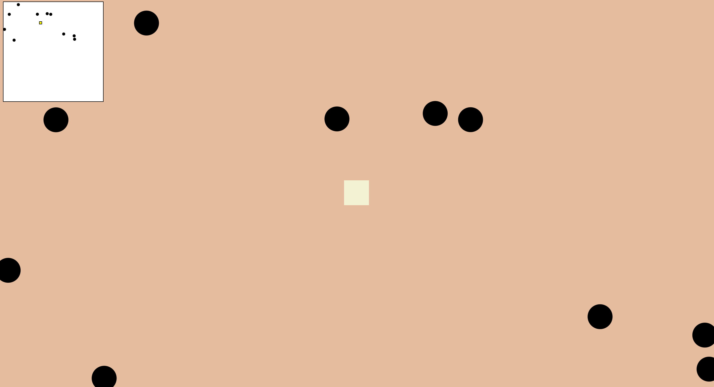

# Hack Club Arcade Game Jam

Welcome to the Hack Club Arcade Game Jam! This is an exciting and challenging game where you must navigate an ivory colored square across a desert background to reach civilization.

## Running the Game

To run the game, ensure you are in a browser environment. The game relies on the `window` object, which is only available in browsers.

Note: The game must be run in a browser environment to function correctly.

## Game Description

In this game, you control an ivory colored square that spawns in a desert background. The objective is to cross the desert to reach civilization, which is some distance in the upward direction relative to the Birds Eye view of the screen. However, there are many black circles that represent holes, and if you fall down one of them, you get taken backward 1 minute of your adventure and get placed there. If a point comes where you fall into a hole within 1 minute of your last reset, or your first "unreset" run, then you lose the game.

## Controls

- Use the arrow keys to move the ivory colored square in the desired direction.

## Objective

- The objective is to cross the desert to reach civilization, avoiding black circles that represent holes, which cause a reset if fallen into.

## Additional Information

- The game uses `p5.js` for rendering the player character, desert background, and holes.
- The game includes mechanics for crossing the desert, avoiding holes, and resetting the player's position upon falling into a hole.

## Minimap

The game now includes a minimap component that renders at the top left corner of the screen. The minimap shows the ivory square in relation to the black circles, providing a quick overview of the player's position and the surrounding obstacles.

### Purpose and Functionality

The minimap helps players navigate the desert by providing a smaller, zoomed-out view of the game area. It displays the player's position as a red square and the black circles as black dots. This allows players to plan their movements and avoid falling into holes.

### How to Use the Minimap

The minimap is automatically displayed at the top left corner of the screen when the game starts. Players can use the minimap to see their position and the locations of the black circles in relation to the game area. The minimap updates in real-time as the player moves and the game progresses.

## Demo

The `Demo` file is an image file used in the game. It is located in the `root` directory of the project. The purpose of the `Demo` file is to provide a visual representation of a specific element in the game.



## Installation

To install and run the project, follow these steps:

1. Clone the repository:
   ```bash
   git clone https://github.com/SkywardSyntax/HackClubArcadeGameJam.git
   ```

2. Navigate to the project directory:
   ```bash
   cd HackClubArcadeGameJam
   ```

3. Install the dependencies:
   ```bash
   npm install
   ```

4. Run the project:
   ```bash
   npm run dev
   ```

## Usage

To play the game, open your browser and navigate to the local server address provided by the development server (usually `http://localhost:3000`). Use the arrow keys to move the ivory colored square and avoid the black circles.

## Contributing

We welcome contributions to the project! If you would like to contribute, please follow these guidelines:

1. Fork the repository.
2. Create a new branch for your feature or bugfix.
3. Make your changes and commit them with clear and descriptive commit messages.
4. Push your changes to your forked repository.
5. Open a pull request to the main repository with a description of your changes.

Thank you for contributing!

## Play The Demo!
Please visit http://40.76.46.99:3000 to play the game

